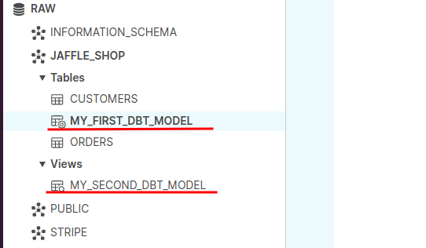

#File: configuration_dbt_en.md  
#Author: Aldo Pizarro  
#Date: 2021-10-13

# ENVIRONMENT CONFIGURATION FOR DBT

**PREREQUISITE: Create free account in Snowflake**

1. Installation of some dependencies in OS:  
    - ***Ubuntu/Debian***  
`sudo apt-get install git libpq-dev python-dev` `python3-pip`  
`sudo apt-get remove python-cffi`  
`sudo pip install --upgrade cffi` 
    - ***CentOS***  
`sudo yum install redhat-rpm-config gcc libffi-devel python-devel openssl-devel`  

1. Install virtualenv:  
`python3 -m pip install virtualenv`  

1. Create virtual environment (Can you use ***/home/$USER***)  
`virtualenv <name_virtualenv>`  
*Nota: This commnand create a folder with virtualenv name*

1. Activate virtual environment  
`. <name_virtualenv>/bin/activate`  
*Para Salir del entorno virtual usar:*  
`deactivate`

1. Install dbt using pip  
`python3 -m pip install cryptography~=3.4`    
`python3 -m pip install dbt`

1. Get testing data: (Optional)  
`wget http://dbt-tutorial-public.s3-us-west-2.amazonaws.com/stripe_payments.csv`  
`wget http://dbt-tutorial-public.s3-us-west-2.amazonaws.com/jaffle_shop_orders.csv`  
`wget http://dbt-tutorial-public.s3-us-west-2.amazonaws.com/jaffle_shop_customers.csv`  

1. Create data base  
`create database raw;`  
`commit;`  
`use database raw;`  

1. Execute load data to Snowflake  
https://courses.getdbt.com/courses/take/fundamentals/texts/17703453-loading-training-data-into-your-warehouse  
**Snowflake Section**

1. Execute the next command in the project root path  
`dbt init`:  Inicialize the DBT Project  

1. Generate file ***profiles.yml*** in ***/home/$USER/.dbt***, you can find a template in the folder *etc*

1. Update file ***dbt_project.yml*** in the project root path, setting the connection parameters  

1. Execute the next command in the project root path  
`dbt debug`: Checks the configuration for ***profiles.yml*** and ***dbt_project.yml*** files

1. Create repository in github

1. For versioning the project to Git, execute the next commands  
`git init`  
`git commit -m "Create a dbt project"`  
`git branch -M main`  
`git remote add origin https://github.com/apizarroe/dbt-tutorial.git`  
`git push -u origin main`  
*Nota: Use the Git repository created in the previous step*  

1. Checking succesfully deployment, execute the next command in the project root path  
`dbt run`: Deploy all models in the Snowflake Environment  

1. Generate project documentation, execute the next command in the project root path  
    - `dbt docs generate`: Generates project documentation in a website  
    Optional: `dbt docs generate --no-compile`
    - `dbt docs serve`: Generates a web server with port 8000 by default and publish the documentation. The root path for website is the folder **target/**  
    Optional: `dbt docs serve --port 8001`  

 

## Referencias:

- Install dbt-cli:  
https://docs.getdbt.com/dbt-cli/installation  

- Environment configuration:  
https://docs.getdbt.com/tutorial/setting-up  

- Example of model depoyment in dbt:  
https://www.getdbt.com/getting-started-tutorial/#!/model/model.jaffle_shop.stg_orders  

- Configuration del dbt-cloud:  
https://docs.getdbt.com/docs/dbt-cloud/cloud-overview  

- Create documentation:  
https://docs.getdbt.com/reference/commands/cmd-docs  

- Guide to Basic Commands:  
https://github.com/dbt-labs/jaffle_shop

- Aditional documentation about the Framework:  
https://docs.getdbt.com/  
